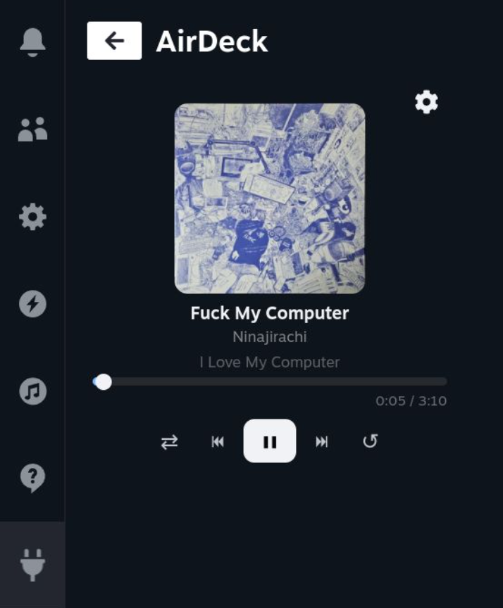

# AirDeck 🎧

AirDeck is a Decky Loader plugin for the Steam Deck that integrates mobile media playback controls directly into the Quick Access Menu (QAM) via Bluetooth (BlueZ DBus).

It controls your music (Apple Music so no Cider to buy, Spotify, etc.) playing from your phone or external device right while gaming. It is really useful to play Forza Horizon 6.

<p align="center">
  
</p>!

---

## Features

* **Media Controls:** Play, Pause, Next, Previous, Shuffle, Repeat and Track Positioning directly from SteamOS.
* **Now Playing Info:** Displays track title, artist and cover via a Toast Notification.


* **Artwork Fetching:** Dynamically fetches (iTunes and MusicBrainz APIs) and displays album art via Bluetooth metadata, since this information is not conveyed through AVRCP.

---

## Development & Deployment

### Prerequisites

* **Node.js & pnpm** (for the frontend React/TypeScript part)
* **Decky Loader** installed on your Steam Deck
* **SSH enabled** on your Steam Deck

### Quick Deploy (Local Development)

To avoid typing your password every time, it is highly recommended to copy your SSH key to your Steam Deck first:
```bash
ssh-copy-id deck@<YOUR_STEAM_DECK_IP>

Once set up, you can build and deploy the plugin with the following commands. Replace <YOUR_STEAM_DECK_IP> with your Deck's actual IP address:

# 1. Build the frontend
pnpm build

# 2. Deploy files to the Steam Deck
DECK_IP="<YOUR_STEAM_DECK_IP>"
PLUGIN_DIR="~/homebrew/plugins/AppleMusicDeck"

scp dist/index.js deck@$DECK_IP:$PLUGIN_DIR/dist/
scp main.py deck@$DECK_IP:$PLUGIN_DIR/

# 3. Restart Decky to apply changes (Enter your sudo password when prompted)
ssh -t deck@$DECK_IP "sudo systemctl restart plugin_loader"
```

Checking Logs
To monitor your plugin's backend logs and debug API fetches (iTunes/MusicBrainz) or DBus signals in real-time:

```bash
ssh deck@<YOUR_STEAM_DECK_IP> "journalctl -u plugin_loader -f --no-pager | grep -i 'bluez\|apple\|artwork'"
```

---

## 🤝 Contributing

Contributions are welcome! If you want to help improve AirDeck, follow these steps:

1. **Fork** the repository.
2. **Clone** your fork locally:
```bash
   git clone [https://github.com/](https://github.com/)<YOUR_USERNAME>/AirDeck.git
```
3. **Install** frontend dependencies:
````bash
pnpm install
````

4. **Create** a new branch for your feature or bugfix:
```bash
git checkout -b feature/amazing-feature
```

5. **Commit** your changes and push them to your fork:
```bash
git commit -m "feat: add some really truly cool feature"
git push origin feature/WOW-feature
```
6. **Open** a Pull Request on the main repository.

I'm not an role model on code clean-ness, but please make sure your code is clean and properly documented before submitting a PR.

---

## Upcoming Fixes & Features

Looking to help or wondering what's next? Here is the current focus for AirDeck development:

* [ ] **Real-time Progress Bar Updates:** Fix the progress bar and timer to smoothly update when seeking directly from the connected mobile device (currently it only synchronizes on Play/Pause states). Honestly i got no clue on how to do that. I tried to search, but well.
* [ ] **Steam Deck Position Control:** Implement manual playback positioning and scrubbing directly from the SteamOS Quick Access Menu interface.